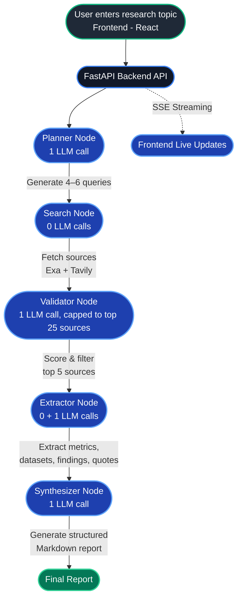

# Multi-Agent Research Citation Engine (LangGraph Edition)

A production-grade AI research assistant built with **LangGraph** (Python) and a **React + Vite** frontend, deployed live on **Render**.
Enter any research topic and receive a structured Markdown report with accurate citations, extracted evidence, and verified references.

Originally built with CrewAI, migrated to LangGraph for lower LLM call overhead and finer control over the pipeline — see [Migration Notes](#migration-notes) and [Deployment Notes & Lessons Learned](#deployment-notes--lessons-learned) below.

**Live demo:** `https://research-engine-ui.onrender.com`

---

## What It Does

1. **Planner node** decomposes your topic into 4–6 targeted search queries (1 LLM call)
2. **Search node** retrieves up to 8 sources per query from arXiv, IEEE, ACL, GitHub, and official docs via Exa and Tavily APIs (0 LLM calls — deterministic)
3. **Validator node** scores every source (1–10) on credibility, recency, and technical depth — keeps only the top 5 (1 batched LLM call)
4. **Extractor node** fetches each source (PDF or webpage) and extracts metrics, datasets, findings, and verbatim quotes (0 LLM calls for fetching + 1 batched LLM call for extraction)
5. **Synthesizer node** merges all evidence into a structured Markdown report with inline citations — no hallucination, every claim is grounded (1 LLM call)

**Total: exactly 4 LLM calls per full research run**, regardless of topic — designed to work reliably on a free-tier LLM provider (Hugging Face Inference Providers) without hitting rate limits.

---

## Architecture



All nodes communicate via a shared LangGraph `StateGraph` (`GraphState` TypedDict) — never raw documents between steps. The FastAPI backend streams node progress to the React frontend via Server-Sent Events (SSE).

---

## Tech Stack

| Layer | Technology |
|---|---|
| Backend API | FastAPI + Uvicorn |
| AI Orchestration | LangGraph (StateGraph) |
| LLM | Hugging Face Inference Providers (`novita`) **or** OpenAI |
| Search | Exa neural search (primary) + Tavily (fallback) |
| PDF parsing | PyMuPDF (`fitz`) |
| Web parsing | BeautifulSoup4 |
| Frontend | React 18 + Vite + TypeScript |
| UI | shadcn/ui + Tailwind CSS |
| Streaming | Server-Sent Events (SSE) |
| Deployment | Render (backend web service + static frontend) |

---

## Quick Start (Windows)

### 1. Clone & set up the backend

```powershell
git clone <repo-url>
cd research-engine-langgraph

python -m venv marcl
.\marcl\Scripts\Activate.ps1
pip install -r backend\requirements.txt
```

### 2. Configure environment

Create a `.env` file in the **project root** (same level as `backend/`, not inside it):

```dotenv
LLM_PROVIDER=huggingface
HF_TOKEN=hf_your_token_here
HF_MODEL=meta-llama/Llama-3.1-8B-Instruct:novita
LLM_MAX_TOKENS=8192
LLM_TEMPERATURE=0.3

# OPENAI_API_KEY=sk-your_key_here
# OPENAI_MODEL=gpt-4o

EXA_API_KEY=your_exa_key_here
TAVILY_API_KEY=your_tavily_key_here

OUTPUT_FILE=research_report.md
ALLOWED_ORIGINS=
```

**Important — picking a working `HF_MODEL:provider` pair:** Hugging Face's router (`https://router.huggingface.co/v1`) requires a valid `model:provider` combination, and *not every provider serves every model*. Don't guess — query the model's actual live provider list before picking one:

```powershell
curl.exe "https://huggingface.co/api/models/meta-llama/Llama-3.1-8B-Instruct?expand[]=inferenceProviderMapping" -H "Authorization: Bearer YOUR_HF_TOKEN"
```

This returns the definitive list of providers currently hosting that exact model. `:auto` is **not** a valid provider value despite some documentation suggesting otherwise — it will fail with `model_not_supported`.

### 3. Run the backend

**Important:** run from the **project root**, not from inside `backend/` — the code uses absolute imports (`from backend.tools... import ...`).

```powershell
uvicorn backend.app:app --reload --port 8000
```

### 4. Run the frontend

Open a **second terminal**:

```powershell
cd frontend
npm install
npm run dev
```

Open the printed local URL (typically `http://localhost:8080`) — Vite proxies `/api/*` to the FastAPI backend automatically in dev mode.

### 5. CLI usage (no server, no frontend)

```powershell
python -m backend.main --topic "attention mechanisms in transformers"
```

Writes the report to `research_report.md` in the project root.

---

## Verified Working Environment

- Python **3.11.7**
- Node.js **18.x**
- HF router: `https://router.huggingface.co/v1`
- **Confirmed working model+provider:** `meta-llama/Llama-3.1-8B-Instruct:novita`
- `LLM_MAX_TOKENS=8192` (Extractor's batched call needs headroom; Validator uses a lower override of 2048 internally)
- Backend deps: pinned exactly via `pip freeze` in `backend/requirements.txt`
- Frontend deps: pinned via `frontend/package-lock.json`
- Deployed and load-tested on Render's free tier (both backend web service and static frontend)

---

## Project Structure

```
research-engine-langgraph/
├── backend/
│   ├── graph_state.py             # Shared LangGraph state schema
│   ├── llm.py                     # LLM provider detection + rate-limit-safe invoke (supports per-call max_tokens override)
│   ├── parsing.py                 # Shared JSON-extraction helper
│   ├── graph.py                   # StateGraph wiring (5 nodes, linear edges)
│   ├── app.py                     # FastAPI server with SSE streaming + load_dotenv()
│   ├── main.py                    # CLI entry point
│   ├── requirements.txt
│   ├── agents/
│   │   ├── planner_agent.py       # System prompt: Research Strategist
│   │   ├── search_agent.py        # Deterministic Exa/Tavily orchestration
│   │   ├── validator_agent.py     # System prompt: Source Quality Evaluator
│   │   ├── extractor_agent.py     # System prompt + deterministic content fetch
│   │   └── synthesizer_agent.py   # System prompt: Research Writer
│   ├── tasks/
│   │   ├── planning_task.py       # Planner node logic (1 LLM call)
│   │   ├── search_task.py         # Search node logic (0 LLM calls)
│   │   ├── validation_task.py     # Validator node logic (1 LLM call, source-count capped, defensive JSON-shape parsing)
│   │   ├── extraction_task.py     # Extractor node logic (1 batched LLM call, strict per-source output budget)
│   │   └── summary_task.py        # Synthesizer node logic (1 LLM call)
│   ├── tools/
│   │   ├── search_tool.py         # Exa + Tavily search tools
│   │   ├── pdf_extractor.py       # PyMuPDF PDF text extractor
│   │   └── web_parser.py          # BeautifulSoup webpage parser
│   └── utils/
│       ├── token_utils.py         # count_tokens, truncate_text
│       └── text_chunker.py        # chunk_text with overlap
├── frontend/
│   ├── src/
│   │   ├── api/client.ts          # REST client — resolves VITE_API_URL for prod, /api for dev
│   │   ├── hooks/
│   │   │   ├── useJobStream.ts    # SSE consumer — resolves VITE_API_URL for prod, ignores expected post-completion stream closure
│   │   │   └── useElapsedTime.ts
│   │   ├── pages/
│   │   │   ├── Index.tsx
│   │   │   └── ResearchPage.tsx
│   │   └── components/
│   │       ├── PipelineSidebar.tsx
│   │       └── ReportViewer.tsx
│   ├── package.json
│   └── vite.config.ts
├── render.yaml
└── README.md
```

---

## Token & LLM-Call Safety

| Layer | Limit | Mechanism |
|---|---|---|
| Document download | 10 MB | Streaming cap in `pdf_extractor.py` |
| Extracted text per source | 3 000 chars | Hard truncation in tools |
| Text chunks | 800 tokens | `chunk_text()` in `text_chunker.py` |
| Sources sent to Validator | 25 max | Trimmed in `validation_task.py` regardless of how many Search finds |
| Validator snippet length | 200 chars | Trimmed before building the prompt, independent of the tool's own 500-char cap |
| Evidence per source | 300 tokens (soft) | Prompt instruction in `extraction_task.py`, reinforced with an explicit total-response ceiling |
| Global LLM output ceiling | 8 192 tokens | `LLM_MAX_TOKENS` env var, set on the `ChatOpenAI` instance |
| Validator-specific ceiling | 2 048 tokens | Passed via `max_tokens_override` in `safe_invoke()` — its output is much smaller than the Extractor's |
| LLM calls per run | 4 total | Deterministic search + extractor-fetch, batched validator + extractor-evidence calls |
| LLM call retries | Exponential backoff, 5 attempts | `tenacity` in `llm.py` |

---

## Output Format

```markdown
# Research Summary: <Topic>

## Key Insights

1. **<Headline>**
   <Supporting evidence, 2–4 sentences.>
   *Source: [1]*

## Methodology Overview
<Concise description drawn from extracted methodology snippets.>

## Benchmarks & Metrics
| Metric | Value | Source |
|--------|-------|--------|
| ...    | ...   | [1]    |

## Sources

[1] <Title>
    <URL>
```

---

## Deployment (Render)

This project deploys as two separate Render services (backend + static frontend), defined in `render.yaml`.

**Critical:** because the backend uses absolute imports (`backend.*`), the backend service's `rootDir` must be the **project root**, not `backend/` — with `startCommand: uvicorn backend.app:app --host 0.0.0.0 --port $PORT`.

```yaml
services:
  - type: web
    name: research-engine-api
    runtime: python
    rootDir: .
    buildCommand: pip install -r backend/requirements.txt
    startCommand: uvicorn backend.app:app --host 0.0.0.0 --port $PORT
    plan: free
    healthCheckPath: /api/research
    envVars:
      - key: HF_TOKEN
        sync: false
      - key: HF_MODEL
        value: meta-llama/Llama-3.1-8B-Instruct:novita
      - key: LLM_PROVIDER
        value: huggingface
      - key: EXA_API_KEY
        sync: false
      - key: TAVILY_API_KEY
        sync: false
      - key: LLM_TEMPERATURE
        value: "0.3"
      - key: LLM_MAX_TOKENS
        value: "8192"
      - key: OUTPUT_FILE
        value: research_report.md
      - key: ALLOWED_ORIGINS
        sync: false
      - key: PYTHON_VERSION
        value: 3.11.7

  - type: web
    name: research-engine-ui
    runtime: static
    rootDir: frontend
    buildCommand: npm install && npm run build
    staticPublishPath: ./dist
    pullRequestPreviewsEnabled: false
    routes:
      - type: rewrite
        source: /*
        destination: /index.html
    envVars:
      - key: VITE_API_URL
        sync: false
```

### Deploy steps

1. Push this repo to GitHub (confirm `.env` is git-ignored first — see below).
2. In Render, create a new **Blueprint** from `render.yaml`.
3. Set the backend env vars marked `sync: false` in the Render dashboard: `HF_TOKEN`, `EXA_API_KEY`, `TAVILY_API_KEY`.
4. Once the frontend deploys, copy its Render URL and set it as the backend's `ALLOWED_ORIGINS` (no trailing slash).
5. Once the backend deploys, copy its Render URL + `/api` and set it as the frontend's `VITE_API_URL`, then trigger a frontend redeploy so Vite bakes it into the build.

### `.gitignore` must include

```
.env
marcl/
__pycache__/
*.pyc
node_modules/
research_report.md
research_crew.log
frontend/dist/
```

---

## Deployment Notes & Lessons Learned

Getting this running on Render's free tier surfaced several real issues worth documenting, since they're easy to reintroduce if the code is refactored later.

1. **`load_dotenv()` must be called in `app.py`, not just `main.py`.** The CLI entrypoint calls it, but `uvicorn backend.app:app` doesn't go through `main.py` at all — without an explicit `load_dotenv()` in `app.py`, all env vars silently read as `None` under uvicorn.

2. **The Hugging Face Inference API endpoint changed.** The legacy `api-inference.huggingface.co` host has been retired in favor of `https://router.huggingface.co/v1`. Using the old host produces a DNS resolution failure (`getaddrinfo failed`), not a clean HTTP error — easy to misdiagnose as a network problem.

3. **Provider suffixes are mandatory and must be verified, not guessed.** `model:provider` pairs are specific — a model can be live on `novita` but return `model_not_supported` on `together` or `hf-inference`. `:auto` is not a valid provider despite intuitive appeal. Always check `inferenceProviderMapping` via the API directly (see Quick Start above) before hardcoding a provider.

4. **LLM output truncation cascades through the pipeline one stage at a time.** Each of Validator and Extractor initially failed with truncated/unparseable JSON because `max_tokens` wasn't set at all (relying on the provider's default). Fixing max_tokens for one stage just moved the same failure to the next, larger-output stage — the real fix required both a higher global ceiling **and** shrinking the input (capping sources to 25, trimming snippets) so the prompt+completion together stay within the model's actual context window.

5. **The Validator's LLM output shape isn't 100% consistent.** It usually returns `{"validated_sources": [...]}` as instructed, but occasionally returns a plain JSON array instead. `validation_task.py` now defensively handles both shapes rather than assuming a dict and crashing with `AttributeError: 'list' object has no attribute 'get'`.

6. **In-memory job storage (`JOBS` dict in `app.py`) does not survive process restarts or redeploys.** Any Render redeploy, or local `--reload` triggered by a file save, wipes all job history. Revisiting an old job ID after a restart returns 404 — this is expected with the current architecture, not a bug. See "Extending the System" below for how to add real persistence.

7. **The `render.yaml` backend service's `rootDir` cannot be `backend/`.** Because the code uses `from backend.xxx import ...` absolute imports, the process's working directory must be the project root. `rootDir: backend` produces `ModuleNotFoundError: No module named 'backend'` on Render.

8. **SSE hooks must resolve the API base URL the same way the REST client does.** `client.ts` correctly used `import.meta.env.VITE_API_URL ?? '/api'`, but `useJobStream.ts` initially hardcoded a relative `/api/research/:id/stream` path. This works locally because Vite's dev proxy silently rewrites relative `/api` calls — but in production there is no proxy, so the request resolved against the **static frontend's own domain** instead of the backend, got caught by the SPA fallback rewrite rule, and returned `index.html` instead of an SSE stream. This produced an *instant* connection failure that looked identical to a real backend crash, even when backend logs showed a fully successful pipeline run. Any new fetch/EventSource call added to the frontend must use the same `VITE_API_URL` resolution pattern as `client.ts`.

9. **The browser's native `EventSource` fires a generic `error` event on any connection close — including expected, successful ones.** When reconnecting to an already-completed job, the backend correctly replays past events then closes the stream; the browser reports this exact same closure as `error` regardless of whether it was a real failure. The frontend must track completion state locally (e.g. a ref) and ignore `error` events that occur *after* a real `done`/`error` event was already processed, or every successful run will display a false "Connection lost" message the instant the stream ends.

10. **Diagnose 400-level LLM errors by reading the exact response body, not by guessing.** Every "model/provider not supported" issue in this project was resolved definitively only after reading HF's actual JSON error message or querying `inferenceProviderMapping` directly — generic retries or swapping providers blindly wasted far more time than checking the source of truth first.

---

## Extending the System

| Goal | Where to change |
|---|---|
| Add a new search backend | `tools/search_tool.py` — create a new `BaseTool` subclass |
| Change number of top sources | `tasks/validation_task.py` — update `MAX_SOURCES_FOR_VALIDATION` and the rubric prompt |
| Support local LLMs (Ollama) | `llm.py` `build_llm()` — add an `ollama` branch pointing `ChatOpenAI` at a local base_url |
| Add persistence across restarts | `app.py` — replace the in-memory `JOBS` dict with SQLite (survives `--reload`) or a hosted Postgres/Redis instance (survives full redeploys on Render) |
| Export to PDF | Post-process `research_report.md` with `pandoc` or `weasyprint` |
| Add a new agent | Create agent + task files, wire into `graph.py` |
| Reduce redundant frontend polling | Audit whatever triggers the jobs-list `GET /api/research` calls (likely `Index.tsx`) — currently polls continuously rather than on a sensible interval or only while a job is active |

---

## Migration Notes

This project was originally built with **CrewAI** (sequential `Agent`/`Task`/`Crew` pattern) and migrated to **LangGraph** to:

- Reduce LLM call count from CrewAI's ReAct-style tool-calling loops (`max_iter=15–20` per agent) down to a fixed **4 LLM calls per run** — critical for running reliably on a free-tier LLM provider.
- Replace implicit CrewAI task context-passing with an explicit, typed `GraphState` shared across nodes.
- Gain direct control over which steps use an LLM at all — Search and the content-fetch half of Extraction are now pure deterministic Python, with no LLM reasoning overhead.

Tools (`search_tool.py`, `pdf_extractor.py`, `web_parser.py`) and utils (`token_utils.py`, `text_chunker.py`) required no logic changes — only an import swap from `crewai.tools.BaseTool` to `langchain_core.tools.BaseTool`, since they were already Pydantic-based and framework-agnostic by design.

---

## Requirements

- Python 3.11.7
- Node.js ≥ 18
- Hugging Face token **or** OpenAI API key
- Exa API key (free tier at [exa.ai](https://exa.ai))
- Tavily API key (optional, free tier at [tavily.com](https://tavily.com))